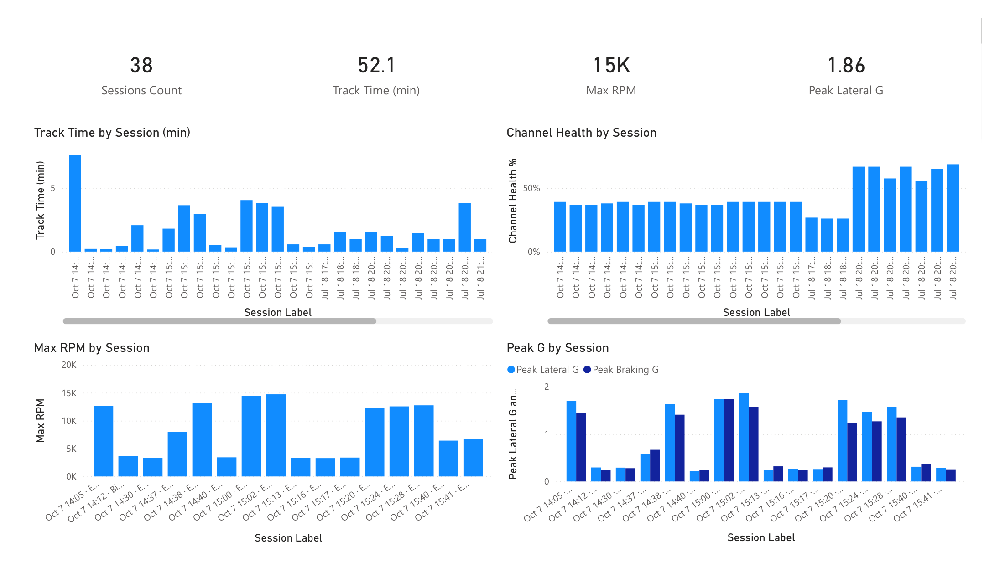
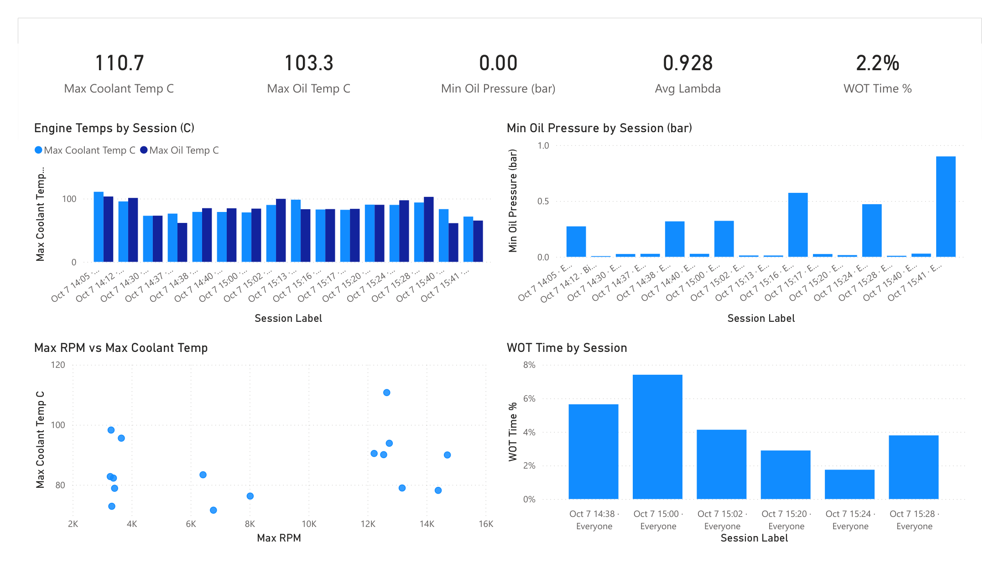
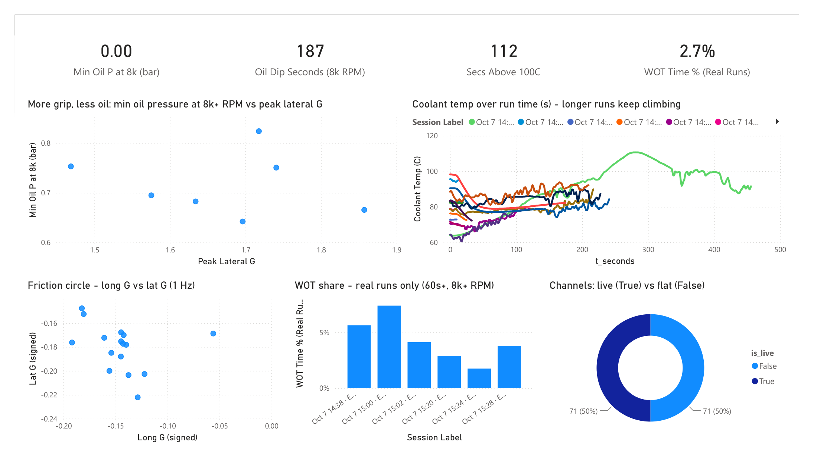

# Telemetry Reports

Rendered pages from the Power BI report built over this repo's REST API
(`api/`), plus the season analyses. The report source is committed as a PBIP
project in [`powerbi/`](../powerbi/README.md); these PNGs are the shareable
output, since refreshing the real thing needs a live API.

Seven pages, four for the 2023 combustion car and three for the 2026 EV.

## 2023, UTA Autocross, Oct 7

All 18 logged sessions come from a single evening, so "season" here means that
one event. The figures below are reproducible from the model's measures.

### Season Overview

This is the shape of the evening: 18 sessions, 33.7 min of total logged time, a
15K max RPM, and 1.86 g peak lateral. The per-session bars show how uneven the
runs were. Eight are 10–26 s aborted starts and restarts (note the three inside
two minutes around 20:16), while only a handful are full runs. Channel health
sits flat at ~39% for every session (see Findings for why), and peak
lateral/braking G track together on the real runs, which is the balance you want.

### Engine Health

The cards read the season-worst: 110.7 °C coolant, 103.3 °C oil, and 0.931
average lambda (slightly rich). Temperatures climb with run length, so the short
runs sit in the 70s–80s while the long runs push past 100 °C. The **Max RPM vs
Max Coolant Temp** scatter shows the hottest points belong to the sustained
high-RPM runs, not the brief ones. The "Min Oil Pressure" card reads 0.00 because
at least one logged second sits at zero; the per-session floors are on the
Findings page.

### Findings

The four things worth acting on, plus a calibration tell.

1. **Oil starvation under cornering.** At 8,000+ RPM, oil pressure averages
   ~3 bar, but the 1-second minimums drop to **0.64–0.83 bar** per session
   (the "more grip, less oil" scatter), with **187 s** of sub-1.5-bar dips at
   8k+ across the season. In S7 those dips coincided with ~1.2 g lateral load,
   more than double the session average, which is the classic wet-sump
   pickup-uncovering signature. Sub-1-bar at 8k+ RPM risks the rod bearings.
   *Action:* sump baffling, pickup relocation, or an Accusump, plus a
   low-pressure alarm and a bearing inspection.
2. **Cooling runs out on long runs.** Only the 7.6-minute S18 got hot, but it
   hit **110.7 °C** with **112 s above 100 °C**, and the curve never plateaus
   ("coolant temp over run time"). A 22-minute endurance would overheat this
   package. *Action:* radiator capacity, or fan and shroud ducting.
3. **Half the channels are flat, including the valuable half.** The donut shows
   **50 of 82 channels (61%) carried no signal** all season: every wheel speed,
   vehicle speed, wheel slip, gear position, GPS (hence the "NO GPS" session
   names), fuel trims, and knock. No speed traces, lap times, or slip analysis
   are possible from 2023 data. *Action:* fix the wiring and logger config before
   the next event, the single biggest data-quality lever.
4. **Full throttle is barely used.** On real runs (60 s+ and 8k+ RPM), wide-open
   throttle is only **~2–7%** of samples against a 14,706 max RPM. *Action:* a
   gearing or driver-coaching conversation.

**Bonus, an accelerometer offset.** The friction circle plots per-session average
longitudinal vs lateral G, and the cluster sits at roughly **−0.15 g / −0.18 g**
instead of centered on zero, a small but consistent sensor mounting/zero offset
worth trimming. A true per-second friction cloud spanning the full ±1.8 g
envelope would need the raw reading rows rather than the session-average measures
used here, which is a good next refinement.

## 2026, drive day, Jul 18

21 unique sessions across four drivers (Emiliano 7, Tristan 7, Ryan 4, Yianni 2,
plus one unattributed shakedown), 19.8 min logged at 10 Hz. Five files are the
same run filed under two drivers; `ingestion_source` keeps both attributions.
Screenshots for the three EV pages are pending an export from Power BI Desktop.

Hardware identified from the channel names: a **DTI HV-500 family inverter**
(the signal names `Actual_FOC_id`, `Actual_FOC_iq`, `Actual_Brake` are verbatim
from DTI's published CAN map, and its firmware is VESC-derived) driving a
liquid-cooled motor, with an **Orion BMS 2** on the accumulator.

### Read this first: three channels do not mean what they are named

1. **`Pack_SOC` is not state of charge.** It is byte-identical to
   `TSB HighTemp` in **100.00%** of samples and matches `Therm1_HighVal` in
   99.3%. It rises monotonically 32 to 41 across the day while the car
   discharges 1.36 kWh. It is a pack temperature in Celsius, and the BMS SOC
   message is mis-mapped in the logger config. **Every SOC number in this drop
   is unusable**, including the "SOC Drop %" card.
2. **`Fault Code` is mostly not a fault.** It takes three values: 0, 2 and 4.
   Code 2 is DTI "Undervoltage", which is what the inverter reports when it is
   awake on low voltage and the tractive system is not energized. Conditioning
   on `Energized = 1 AND RTD = 1` collapses the fault rate from 22% of all
   samples to **82 of 9,060 = 0.91%**.
3. **`Motor RPM` may be electrical, not mechanical.** DTI broadcasts
   `Actual_ERPM`, which is mechanical RPM times pole pairs. A torque
   cross-check says the logged value behaves as mechanical (at 1:1 the implied
   median torque is 63 Nm, plausible for this class; at 4 pole pairs it would be
   252 Nm, which is not), but **confirm the divide against the logger config**
   before quoting 3,326 RPM anywhere.

Also identically zero for the whole drop, so no field-oriented-control analysis
is possible: `Actual_FOC_id`, `Actual_FOC_iq`, `MC Throttle`, `Actual_Brake`,
`ALARMS1`, `WATER T ALM`. DTI packet 0x23 is not being broadcast or not decoded.

`uFLAGS1` reconstructs exactly from the boolean channels as a bit-packed byte
(RTD 1, Energized 2, LV Low 4, Motor Temp High 8, MC Temp High 16, Logging 32,
TSB Temp 64, Stop Logging 128), verified on **11,913 of 11,913 rows**. The
value 160 is Logging + Stop Logging, the idle paddock state, not an alarm.

### EV Drive Day

**The headline track time is inflated.** Of 19.8 min logged, the tractive system
is live for 15.6 min and the motor actually turns for **11.7 min (59%)**. Four
sessions have zero motor motion. Yianni's only two unique files are both
stationary, so there is no driving data for that driver at all.

Peak load is real but the day was not fast: peak 37.8 kW against the FSAE
**EV.3.3.1** 80 kW limit (53% headroom, 34.4 kW on a 500 ms rolling mean),
mean 4.1 kW while moving, peak DC 129.5 A, peak AC 380.2 A. Median peak-AC to
peak-DC ratio is 3.25.

**Duty cycle is clipping at the firmware ceiling.** 95.0% is the VESC
`MCCONF_L_MAX_DUTY` default, set by the high-side bootstrap gate driver needing
low-side on-time. 33 samples sit at exactly 94.9 or 95.0. At the top end the car
is **voltage-limited, not current-limited**. More top speed needs field
weakening or a higher pack voltage, not more current.

**Energy is the one metric short runs measure honestly**, because it is an
integral. Total 1.362 kWh over 701 s of motor-turning, which scales to
**116 Wh per 59.6 s endurance lap**. Real FSAE Electric 2026 Michigan teams ran
129 to 266 Wh/lap, with 308 Wh/lap the cutoff for zero efficiency points
(**D.13.4.5**). That looks efficient, but at 4.1 kW mean it mostly reflects
gentle driving rather than an efficient car. Note that `DC Current` never goes
negative (clamped at 0) while `Pack_Current` reaches -16.9 A, so regen exists
and the DC channel cannot measure it. FSAE **D.13.4.2** credits recovered energy
in full, so that is a scoring channel worth fixing.

### EV Thermal

Absolute temperatures are comfortable. Motor peaks **61.9 C** against Emrax's
120 C winding limit and AMK's 125 C derate onset; controller peaks **68.9 C**;
pack peaks **41 C** against the hard **60 C** ceiling in FSAE **EV.7.5.2**.
Time-at-level is the honest view: the motor is at or above 55 C for 8.1% of
moving samples and above 60 C for 0.5%.

**Coolant inlet temperature is the number that is actually out of spec.**
Radiator inlet runs a median of 50 C and peaks at 61 C against an ambient of
about 23 C, so approach temperature is 27 to 38 K. That inlet exceeds Emrax's
50 C maximum inlet on **50% of moving samples** and AMK's 40 C motor inlet spec
on **100%**. Coolant inlet is the boundary condition every motor datasheet rates
against.

**The flow is the problem, and the sensor is not.** Physics closes
independently: 6.9 kW mean electrical at roughly 92% combined efficiency puts
about 0.56 kW into the coolant; plain water (FSAE **T.5.5** forbids glycol)
carries 68.6 W per L/min per K; at the observed 2 K median radiator delta that
implies **4.1 L/min**. The sensor's median reading while the motor turns is
**4.0 L/min**. It agrees with thermodynamics to within 2.5%.

That flow is far below spec. AMK requires 4 L/min per motor **and** 10 L/min for
the inverter cold plate:

| | |
|---|---|
| median flow while the motor turns | **4.0 L/min** |
| samples below 10 L/min | **96.2%** |
| samples below 4 L/min | 29.0% |
| samples reading exactly 0 while the motor turns | **13.9%** |

The small radiator delta is not evidence of a healthy radiator. It is what you
get when almost nothing is flowing. Delta-T alone cannot diagnose a loop, since
it equals heat load divided by mass flow.

### EV Findings

1. **Peak temperature is set by heat soak, not by driving.** Controlling for run
   duration, the correlation between a run's starting motor temperature and its
   maximum is **partial r = +0.897, p < 0.0001** (N = 16). Mean within-run rise
   is only **2.4 C**. Between-run cooling is **0.10 C per idle minute,
   r-squared 0.09, p = 0.27**, statistically indistinguishable from zero: the car
   does not shed heat while parked. *Action:* fix flow and airflow, and treat a
   session block as one continuous thermal event rather than as separate runs.
2. **Coolant flow is at roughly 40% of the inverter cold-plate minimum**, and
   reads zero 13.9% of the time the motor is turning. *Action:* verify pump duty
   and bleed the loop before touching anything else in the cooling system. The
   pump, not the radiator core, is the first suspect.
3. **The inverter is tripping on absolute overcurrent.** DTI fault code 4 is
   "ABS. Overcurrent", AC current exceeding the configured absolute maximum. 79
   samples across 7 sessions, and in **100%** of them AC current has collapsed to
   0 A while the bus holds 319 V. That is a genuine torque cut which self-clears
   in about 100 ms. Peak AC current in the drop is 380.2 A. *Action:* a
   configuration fix, lower the commanded current ceiling or soften the ramp so
   the car stops bouncing off its own limit.
4. **21 of 60 channels are flat at zero for the entire drop.** The whole inertial
   block (`ACC Lat/Long/Vert`, roll/pitch/yaw rate) exists in only **1 of 26
   files**, which is why the drop has two schemas, so no G traces or driver
   dynamics are possible. *Action:* same lever as 2023, validate the logger
   config before the event rather than after.
5. **The flowrate spikes are inverter EMI, not a scaling error.** 150 of 11,913
   samples (1.26%) exceed the 0 to 40 range, peaking at 4,132. Evidence: no
   power-of-two structure (zero samples at 255/256/1023/1024/4095/4096/65535, and
   4,132 is not 4,096); the implied pulse rate is **30,990 Hz, 103 times the
   transducer's mechanical ceiling** and 3.87 times a typical 8 kHz inverter PWM;
   **100%** of spikes occur in moving sessions and 0% while parked; and spikes
   coincide with hard switching (`MC Volts` 311 vs 250, `Motor RPM` 1,358 vs
   799). *Action:* reject any pulse interval below 1 ms in firmware, switch from
   period-based to fixed-window pulse counting, and fit the 1 to 2.2 kohm pull-up
   the sensor requires. A rolling median cleans the existing logs.
6. **`CAN1 ERRORS` is never zero.** It takes only the values 16, 19, 24 and 32,
   stepping by 8, which is the CAN transmit-error-counter increment, and it
   decays as well as rises, so it is a live counter readout rather than a
   cumulative total. It stays far below the 96 warning and 128 error-passive
   thresholds, so the bus works. But `CAN2 ERRORS` is exactly 0 on every row, so
   a correctly built bus in this same car does sit at zero. *Action:* check
   termination (about 60 ohms across CAN-H/L unpowered), stub lengths, and bit
   timing on the inverter bus.

### What this dataset cannot tell you

The whole drive day (19.8 min) is **shorter than a single endurance run**. The
2026 FSAE Electric endurance at Michigan ran 21.9 to 31.7 minutes over 22 km,
and about 40% of entrants did not finish it (23 of 39 finished in 2026, 18 of 30
in 2025). The longest run here is 229 s, roughly 3.8 endurance laps.

So this data **fully covers** Acceleration (3.7 s), Skidpad (4.8 s) and Autocross
(43.9 s), which is 300 of 675 dynamic points. It covers **none** of Endurance
(275) or Efficiency (100).

Thermally it is worse than that. Exponential fits for a thermal time constant
hit the solver bound on 9 of 13 runs: 229 s is too short to identify a time
constant that is plausibly several hundred seconds. Depending on whether tau is
300, 480 or 900 s, the same 229 s run projects a steady-state motor temperature
of 66, 75 or 94 C, and a controller temperature of 66, 71 or 82 C. That last
figure crosses the 80 C ceiling common to Bamocar and Cascadia units.
**Short runs can falsify cooling adequacy. They cannot validate it.** Every peak
temperature here is a lower bound, not an estimate.

Two changes make the next drive day answer what this one cannot: run at least
one deliberate 22 km / 25 min endurance simulation, and log DC bus voltage and
current at 100 Hz or faster so the 80 kW limit can be audited over the 100 ms
window officials actually use (**EV.3.4.1**). At 10 Hz that window is a single
sample.

**A caution on the statistics.** With 16 to 21 sessions the critical correlation
for p < 0.05 is about 0.48, and screening 39 live channels pairwise would be 741
tests with roughly 37 false positives expected by chance. Worse, per-session
maxima are confounded by session length, since longer sessions have higher
maxima on sampling grounds alone. An earlier draft of this report claimed a
22.9 C-per-kWh heating relationship; controlling for duration collapses it from
r = +0.43 to **partial r = +0.07, p = 0.81**, so it was duration masquerading as
physics and has been withdrawn. Only the heat-soak result survives that control.
Treat everything here as hypothesis-generating for the next test day.

## Reproducing

The visuals are driven by measures in the model's `Engine`, `Driver`,
`Dynamics`, and the six `EV *` folders (`Oil Dip Seconds (8k RPM)`, `Min Oil P at 8k (bar)`,
`Coolant Temp (C)`, `WOT Time % (Real Runs)`, the signed-G pair, etc.). To
rebuild from scratch: bring up the API (`docker compose up -d` then `python
main.py all`), point Power BI's Web/JSON connector at `http://localhost:8000`,
and model the star schema described in the root
[README](../README.md#api-power-bi-connection).
