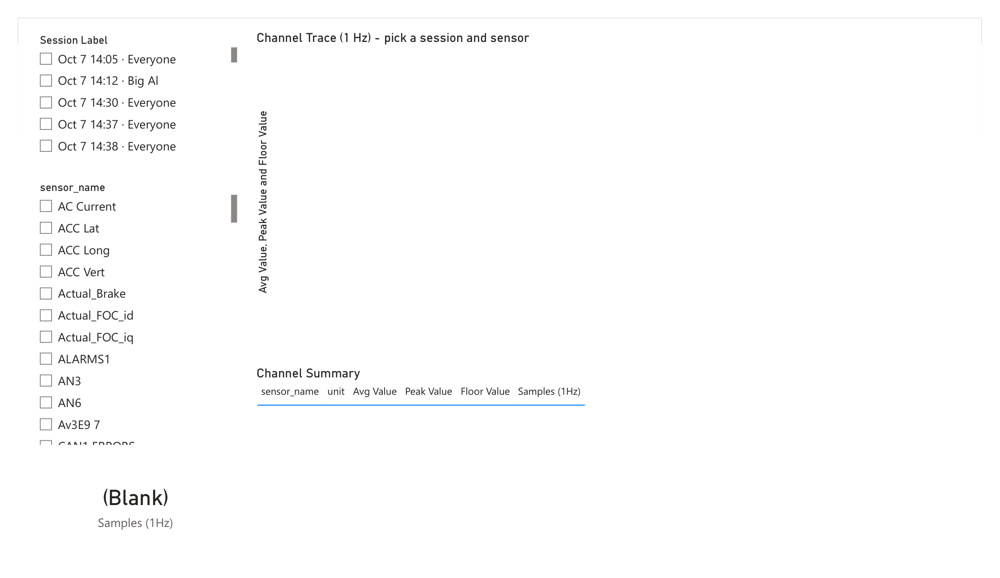
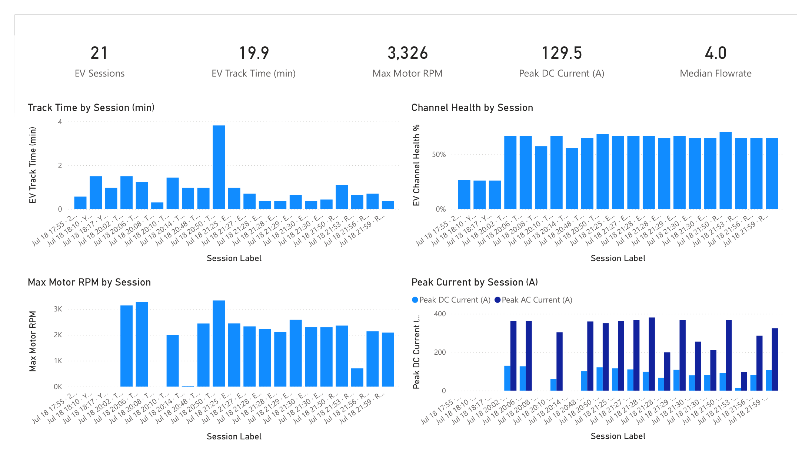
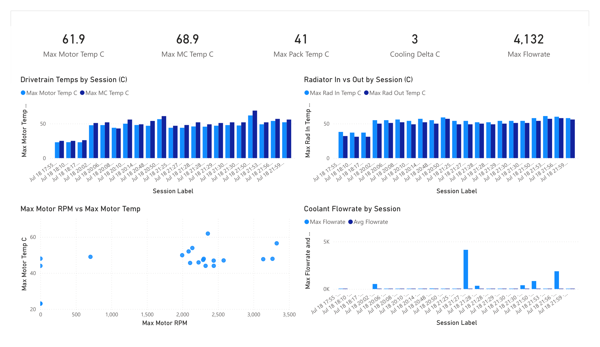
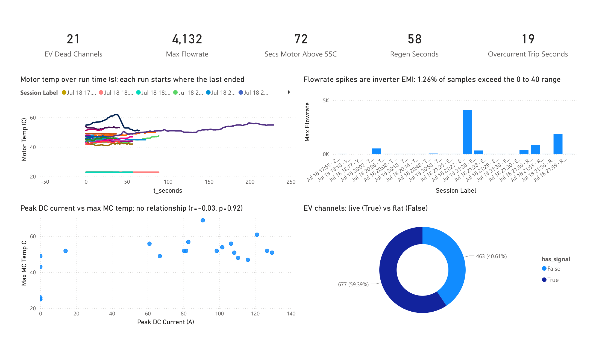

# Telemetry Reports

Rendered pages from the Power BI report built over this repo's REST API
(`api/`), plus the season analyses. The report source is committed as a PBIP
project in [`powerbi/`](../powerbi/README.md); these PNGs are the shareable
output, since refreshing the real thing needs a live API.

Seven pages, four for the 2023 combustion car and three for the 2026 EV.

## 2023, UTA Autocross, Oct 7

All 18 logged sessions come from a single evening, so "season" here means that
one event. The figures below are reproducible from the model's measures.

### Season Overview

This is the shape of the evening: 18 sessions, 33.7 min of total logged time, a
15K max RPM, and 1.86 g peak lateral. The per-session bars show how uneven the
runs were. Eight are 10–26 s aborted starts and restarts (note the three inside
two minutes around 15:16), while only a handful are full runs. Channel health
sits flat at ~39% for every session (see Findings for why), and peak
lateral/braking G track together on the real runs, which is the balance you want.

### Session Deep-Dive

Session and sensor slicers driving a 1 Hz trace with a min/max envelope, plus a
channel summary table. This is the page for asking "what did channel X do in
session Y", and it is the only 2023 page that is not a fixed set of measures.

### Engine Health

The cards read the season-worst: 110.7 °C coolant, 103.3 °C oil, and 0.931
average lambda (slightly rich). Temperatures climb with run length, so the short
runs sit in the 70s–80s while the long runs push past 100 °C. The **Max RPM vs
Max Coolant Temp** scatter shows the hottest points belong to the sustained
high-RPM runs, not the brief ones. The "Min Oil Pressure" card reads 0.00 because
at least one logged second sits at zero; the per-session floors are on the
Findings page.

### Findings

The four things worth acting on, plus a calibration tell.

1. **Oil starvation under cornering.** At 8,000+ RPM, oil pressure averages
   ~3 bar, but the 1-second minimums drop to **0.64–0.83 bar** per session
   (the "more grip, less oil" scatter), with **187 s** of sub-1.5-bar dips at
   8k+ across the season. In S7 those dips coincided with ~1.2 g lateral load,
   more than double the session average, which is the classic wet-sump
   pickup-uncovering signature. Sub-1-bar at 8k+ RPM risks the rod bearings.
   *Action:* sump baffling, pickup relocation, or an Accusump, plus a
   low-pressure alarm and a bearing inspection.
2. **Cooling runs out on long runs.** Only the 7.6-minute S18 got hot, but it
   hit **110.7 °C** with **112 s above 100 °C**, and the curve never plateaus
   ("coolant temp over run time"). A 22-minute endurance would overheat this
   package. *Action:* radiator capacity, or fan and shroud ducting.
3. **Half the channels are flat, including the valuable half.** The donut shows
   **50 of 82 channels (61%) carried no signal** all season: every wheel speed,
   vehicle speed, wheel slip, gear position, GPS (hence the "NO GPS" session
   names), fuel trims, and knock. No speed traces, lap times, or slip analysis
   are possible from 2023 data. *Action:* fix the wiring and logger config before
   the next event, the single biggest data-quality lever.
4. **Full throttle is barely used.** On real runs (60 s+ and 8k+ RPM), wide-open
   throttle is only **~2–7%** of samples against a 14,706 max RPM. *Action:* a
   gearing or driver-coaching conversation.

**Bonus, an accelerometer offset.** The friction circle plots per-session average
longitudinal vs lateral G, and the cluster sits at roughly **−0.15 g / −0.18 g**
instead of centered on zero, a small but consistent sensor mounting/zero offset
worth trimming. A true per-second friction cloud spanning the full ±1.8 g
envelope would need the raw reading rows rather than the session-average measures
used here, which is a good next refinement.

## 2026, drive day, Jul 18

21 unique sessions, four drivers, 19.8 min at 10 Hz. Five files are the same run
filed under two drivers; `ingestion_source` keeps both attributions. The car
runs a **DTI HV-500 family inverter** (VESC-derived firmware, its CAN signal
names are verbatim in the log) and an **Orion BMS 2**.

The car is not hot. It is barely cooled. Coolant flow runs at 40% of the
inverter's minimum, and a run's peak temperature is set by how hot the car
already was, not by how it was driven.

### Three channels are lying

**`Pack_SOC` is not state of charge.** It is byte-identical to `TSB HighTemp` in
**100.00%** of samples. It climbs 32 to 41 across the day while the car
discharges 1.36 kWh. It is a pack temperature. Every SOC number in this drop is
garbage, and the `SOC Drop %` measure is now hidden as `SOC Drop % (INVALID)`.

**`Fault Code` is mostly not a fault.** Values are 0, 2 and 4. Code 2 is DTI
"Undervoltage", which is what the inverter says when the tractive system is off.
Filter to `Energized = 1 AND RTD = 1` and the fault rate drops from 22% of all
samples to **0.91%** (82 of 9,060).

**`Motor RPM` needs verifying.** DTI broadcasts `Actual_ERPM`, mechanical RPM
times pole pairs. A torque cross-check says this logger already divided: at 1:1
the implied median torque is 63 Nm, right for this class; at 4 pole pairs it
would be 252 Nm, impossible. Check the logger config before quoting 3,326 RPM.

Six more channels are identically zero all day, so field-oriented-control
analysis is impossible: `Actual_FOC_id`, `Actual_FOC_iq`, `MC Throttle`,
`Actual_Brake`, `ALARMS1`, `WATER T ALM`. DTI packet 0x23 is not being decoded.

`uFLAGS1` is a bit-packed byte of the boolean channels (RTD 1, Energized 2,
LV Low 4, Motor Temp High 8, MC Temp High 16, Logging 32, TSB Temp 64, Stop
Logging 128), verified on **11,913 of 11,913 rows**. The value 160 is
Logging + Stop Logging, the idle paddock state, not an alarm.

### EV Drive Day

21 sessions between 17:55 and 21:59, nearly all under a minute, with one
3.8-minute run alone in the middle. The first four bars carry no motor RPM.
Channel health steps from 28% to 65% at the fourth session, which is the
tractive system coming alive, not the wiring improving.

**Track time is inflated.** Of 19.8 min logged, the tractive system is live for
15.6 min and the motor turns for **11.7 min**. Four sessions never move. Yianni's
only two unique files are both stationary, so that driver has no data.

**The day was not fast.** Peak 37.8 kW against the 80 kW limit (**EV.3.3.1**),
mean 4.1 kW while moving, peak DC 129.5 A, peak AC 380.2 A at a 3.25 ratio.

**Duty cycle clips at 95.0%**, the VESC firmware ceiling. At the top end this car
is voltage-limited, not current-limited. More speed needs field weakening or a
higher pack voltage, not more current.

**Energy is the one number short runs measure honestly**, because it is an
integral. 1.362 kWh over 701 s of motor-turning scales to **116 Wh per 59.6 s
endurance lap**. Real FSAE Electric 2026 teams ran 129 to 266 Wh/lap against a
308 Wh/lap zero-points wall (**D.13.4.5**). That is not efficiency, it is gentle
driving at 4.1 kW mean.

**Regen is capped by the pack, not the driver.** `Pack_DCL` sits at 181 to 190 A
while `Pack_CCL` sits at 11 to 13 A, a **15.8 to 1** asymmetry. At 320 V that
caps regen at **4.2 kW, 11% of peak drive power**, and the BMS tightens it as the
pack warms (**rho = -0.695**). `Pack_Current` still reaches -16.9 A against a
13 A limit, a 30% overshoot; a cell past datasheet max for 500 ms forces the AMS
to open the shutdown circuit (**EV.7.3.5**).

### EV Thermal

Drivetrain temps climb through the day and never come back down. Radiator inlet
tracks outlet within a couple of degrees every session, so those bars sit on top
of each other. The flowrate chart looks empty because the median is 4 and the
axis is scaled by a 4,132 spike.

Absolute temperatures are fine. Motor peaks **61.9 C** against Emrax's 120 C
limit, controller **68.9 C**, pack **41 C** against the 60 C ceiling in
**EV.7.5.2**. The motor is above 55 C for 8.1% of moving samples and above 60 C
for 0.5%.

**Coolant inlet is the number that is out of spec.** It runs a median of 50 C and
peaks at 61 C against 23 C ambient, an approach of 27 to 38 K. That exceeds
Emrax's 50 C max inlet on **50%** of moving samples and AMK's 40 C motor inlet
spec on **100%**. Inlet temperature is the boundary condition every motor
datasheet rates against.

**The flow is the problem and the sensor is not.** 6.9 kW mean electrical at 92%
combined efficiency puts 0.56 kW into the coolant. Plain water (**T.5.5** forbids
glycol) carries 68.6 W per L/min per K. At the observed 2 K delta that needs
**4.1 L/min**. The sensor reads a median of **4.0**. It agrees with
thermodynamics to 2.5%.

AMK requires 4 L/min per motor and 10 L/min for the inverter cold plate. This
loop delivers:

| | |
|---|---|
| median flow while the motor turns | **4.0 L/min** |
| samples below 10 L/min | **96.2%** |
| samples below 4 L/min | 29.0% |
| samples reading 0 while the motor turns | **13.9%** |

The small radiator delta is not a healthy radiator. It is almost nothing
flowing. Delta-T equals heat load over mass flow, so it diagnoses nothing on its
own.

### EV Findings

Six things to act on, in the order I would act on them.

1. **Coolant flow is at 40% of the inverter cold-plate minimum** and reads zero
   13.9% of the time the motor turns. *Action:* check pump duty and bleed the
   loop. The pump is the suspect, not the radiator core.
2. **Heat soak sets peak temperature, not driving.** Controlling for run
   duration, start temperature predicts peak temperature at
   **partial r = +0.897, p < 0.0001** (N=16). Mean within-run rise is **2.4 C**.
   Between-run cooling is **0.10 C per idle minute, p = 0.27**, which is zero.
   The car does not shed heat while parked. *Action:* treat a session block as
   one continuous thermal event, and fix flow and airflow.
3. **The inverter is tripping on absolute overcurrent.** DTI fault 4, 79 samples
   across 7 sessions. In **100%** of them AC current has collapsed to 0 A while
   the bus holds 319 V: a real torque cut that self-clears in ~100 ms. Peak AC is
   380.2 A. *Action:* lower the commanded current ceiling or soften the ramp.
4. **21 of 60 channels are flat all day.** The entire inertial block exists in
   **1 of 26 files**, which is why the drop has two schemas, so there are no G
   traces and no driver dynamics. *Action:* validate the logger config before the
   event, not after. Same lever as 2023.
5. **The flowrate spikes are inverter EMI.** 150 samples (1.26%) exceed the 0 to
   40 range, peaking at 4,132. No power-of-two structure. The implied pulse rate
   is **30,990 Hz, 103 times the transducer's ceiling** and 3.87 times an 8 kHz
   PWM. **100%** of spikes happen while moving, none while parked, and they
   coincide with hard switching. *Action:* reject pulse intervals under 1 ms,
   count over a fixed window instead of measuring period, and fit the 1 to
   2.2 kohm pull-up the sensor needs.
6. **`CAN1 ERRORS` is never zero.** It takes 16, 19, 24 and 32, stepping by 8,
   which is the transmit-error-counter increment, and it decays as well as
   rises. It stays below the 96 warning threshold, so the bus works. But
   `CAN2 ERRORS` is 0 on every row, so a correct bus on this car does read zero.
   *Action:* check termination, stub lengths and bit timing on the inverter bus.

**One to identify, not act on.** The 12 V rail runs 13.24 to 14.82 V and exceeds
14.6 V on 11.2% of samples. Normal for lead-acid, over cell maximum for LiFePO4.
Find out which one is fitted.

### What this dataset cannot tell you

The whole drive day is shorter than one endurance run. FSAE Electric 2026
endurance took 21.9 to 31.7 minutes over 22 km, and 16 of 39 entrants did not
finish it. The longest run here is 229 s.

So this data covers Acceleration, Skidpad and Autocross, which is 300 of 675
dynamic points. It covers none of Endurance (275) or Efficiency (100).

It cannot answer the cooling question either. Exponential fits for a thermal time
constant hit the solver bound on 9 of 13 runs. Depending on whether tau is 300,
480 or 900 s, the same 229 s run projects a steady-state motor temperature of 66,
75 or 94 C and a controller temperature of 66, 71 or 82 C. Short runs falsify
cooling adequacy; they cannot validate it. Every peak temperature here is a lower
bound.

Two changes fix that next time: run one deliberate 22 km endurance simulation,
and log bus voltage and current at 100 Hz so the 80 kW limit can be audited over
the 100 ms window officials use (**EV.3.4.1**). At 10 Hz that window is one
sample.

**On the statistics.** At N=16 to 21 the critical correlation is about 0.48, and
per-session maxima are confounded by session length. An earlier draft claimed
22.9 C of heating per kWh; controlling for duration collapsed it to
**r = +0.07, p = 0.81**, so it was duration masquerading as physics and it is
withdrawn. Only the heat-soak result survives that control. Everything here is
hypothesis-generating for the next drive day.

## Reproducing

The visuals are driven by measures in the model's `Engine`, `Driver`,
`Dynamics`, and the six `EV *` folders (`Oil Dip Seconds (8k RPM)`, `Min Oil P at 8k (bar)`,
`Coolant Temp (C)`, `WOT Time % (Real Runs)`, the signed-G pair, etc.). To
rebuild from scratch: bring up the API (`docker compose up -d` then `python
main.py all`), point Power BI's Web/JSON connector at `http://localhost:8000`,
and model the star schema described in the root
[README](../README.md#api-power-bi-connection).
